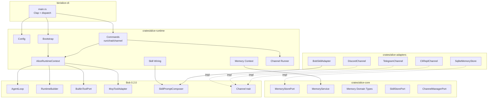

# Design Document: Alice v2 Evolution

| Metadata | Details |
| :--- | :--- |
| **Author** | pb-plan agent |
| **Status** | Draft |
| **Created** | 2026-03-03 |
| **Reviewers** | longcipher maintainers |
| **Related Specs** | specs/2026-02-28-01-alice-hexagonal-agent/ (v1 foundation) |

---

## 1. Executive Summary

Alice v1 delivered a minimal CLI agent with hexagonal memory on top of Bob 0.2.0. This v2 evolution:

1. **Restructures the workspace** into a clean hexagonal architecture (`alice-core`, `alice-adapters`, `alice-runtime`) with a thin `alice-cli` binary composition root.
2. **Enables multi-channel delivery** via Discord and Telegram adapters implementing Bob's `Channel` trait.
3. **Integrates the agent skill system** leveraging Bob's `skills_agent` module for dynamic skill discovery, selection, and prompt composition.
4. **Expands test coverage** comprehensively across all layers (unit, integration, end-to-end).
5. **Achieves feature parity with OpenClaw** — agent loop, skill-driven prompt customization, multi-channel bot deployment, tool composition, and observability.

---

## 2. Requirements & Goals

### 2.1 Functional Goals

| ID | Requirement | Source |
| :--- | :--- | :--- |
| FR-01 | Rename `bin/cli-app` to `bin/alice-cli`; keep it as a thin composition root and CLI entrypoint only | User req #1 |
| FR-02 | Extract domain logic into `crates/alice-core` (ports, domain types, services) | User req #1 |
| FR-03 | Extract adapter implementations into `crates/alice-adapters` (SQLite memory, channel adapters, skill loading) | User req #1 |
| FR-04 | Create `crates/alice-runtime` for Alice-specific runtime wiring (bootstrap, config, context) | User req #1 |
| FR-05 | Implement Discord channel adapter via `bob_core::channel::Channel` trait | User req #2 |
| FR-06 | Implement Telegram channel adapter via `bob_core::channel::Channel` trait | User req #2 |
| FR-07 | Integrate Bob's `skills_agent` for skill loading, selection, and prompt injection | User req #5 |
| FR-08 | Support skill configuration in `alice.toml` (source directories, max selection, token budget) | User req #5 |
| FR-09 | Wire skills into `RequestContext` (system prompt override, selected skills, tool policy) | User req #5 |
| FR-10 | Comprehensive unit tests for all new and migrated modules | User req #3 |
| FR-11 | Integration tests for channel adapters with mock transports | User req #3 |
| FR-12 | End-to-end smoke tests covering skill selection + channel delivery | User req #3 |
| FR-13 | Feature parity with OpenClaw: skill-driven agent, multi-channel, tool composition, tape/memory, observability | User req #4 |

### 2.2 Non-Functional Goals

- **Performance:** Channel adapters must be non-blocking; skill selection bounded by token budget (default 1800 tokens).
- **Reliability:** Graceful degradation — if Discord/Telegram fail to connect, log and continue with remaining channels. If no skills found, operate without skill context.
- **Security:** Bot tokens loaded from environment variables, never hardcoded. Channel adapters validate incoming message sources.
- **Maintainability:** Each crate has clear boundaries; `alice-core` has zero external adapter dependencies.
- **Testability:** All port traits mockable; channel adapters testable with in-process stubs.

### 2.3 Out of Scope

- Web gateway / HTTP API (future phase).
- Routine engines / scheduled task execution.
- Sandbox stack / container isolation.
- Distributed memory synchronization.
- Streaming responses (deferred; Bob supports it but not wired yet).
- Custom skill authoring tooling (skills are loaded from filesystem via Bob's convention).

### 2.4 Assumptions

- **A1:** Bob 0.2.0's `skills_agent` module is feature-gated under `skills-agent` in `bob-adapters`. We need to enable this feature.
- **A2:** Discord integration will use the `serenity` crate (mature Rust Discord library). Telegram will use `teloxide` (mature Rust Telegram bot framework).
- **A3:** The existing `crates/common` will be split — memory modules move to `alice-core` (ports) and `alice-adapters` (SQLite implementation). The `common` crate is retired.
- **A4:** OpenClaw parity means: agent loop with tool calling, skill system, multi-channel bots, memory/tape system, and event observability. We already have agent loop, tools, memory, and tape in v1.

---

## 3. Architecture Overview

### 3.1 Target Workspace Layout

```text
bin/
  alice-cli/              # Thin CLI binary (clap parsing + composition root dispatch)
    src/
      main.rs             # Clap CLI, tracing init, dispatch to commands
      lib.rs              # Re-export cmd_run, cmd_chat, cmd_channel

crates/
  alice-core/             # Domain layer: ports, types, services (zero adapter deps)
    src/
      lib.rs
      memory/
        mod.rs
        domain.rs         # MemoryEntry, RecallHit, HybridWeights, etc.
        ports.rs          # MemoryStorePort trait
        service.rs        # MemoryService (recall, persist, render)
        error.rs          # thiserror types
        hybrid.rs         # Score fusion, FTS sanitization, embedding
      skill/
        mod.rs
        ports.rs          # SkillStorePort trait (Alice-level abstraction)
        types.rs          # AliceSkillConfig, SkillSelection result types
      channel/
        mod.rs
        ports.rs          # ChannelManagerPort trait
        types.rs          # ChannelConfig, ChannelStatus

  alice-adapters/         # Adapter layer: concrete implementations
    src/
      lib.rs
      memory/
        mod.rs
        sqlite_schema.rs  # DDL, FTS5, vec0
        sqlite_store.rs   # SqliteMemoryStore impl MemoryStorePort
      channel/
        mod.rs
        discord.rs        # DiscordChannel impl bob_core::channel::Channel
        telegram.rs       # TelegramChannel impl bob_core::channel::Channel
        cli_repl.rs       # CliReplChannel impl Channel (extract from current lib.rs)
      skill/
        mod.rs
        bob_skill.rs      # Adapter wrapping bob_adapters::skills_agent

  alice-runtime/          # Runtime wiring layer: config, bootstrap, context
    src/
      lib.rs
      config.rs           # AliceConfig with [runtime], [memory], [skills], [channels], [[mcp.servers]]
      bootstrap.rs        # build_runtime() -> AliceRuntimeContext
      context.rs          # AliceRuntimeContext struct
      skill_wiring.rs     # SkillPromptComposer setup + per-request injection
      channel_runner.rs   # Multi-channel event loop
      memory_context.rs   # inject_memory_prompt, persist_to_memory
      commands.rs         # cmd_run, cmd_chat, cmd_channel implementations
```

### 3.2 System Context Diagram



### 3.3 Key Design Principles

1. **Dependency rule (hexagonal):** `alice-core` depends on nothing external. `alice-adapters` depends on `alice-core` + external crates. `alice-runtime` depends on both + Bob. `alice-cli` depends on `alice-runtime` only.
2. **Framework-first:** Continue leveraging Bob's `AgentLoop`, `RuntimeBuilder`, `CompositeToolPort`, `SkillPromptComposer` — Alice adds composition, not reimplementation.
3. **Channel as first-class concept:** Each channel (CLI REPL, Discord, Telegram) implements `bob_core::channel::Channel`. The channel runner manages lifecycle.
4. **Skill composition via Bob's pipeline:** `SkillPromptComposer` handles discovery, scoring, and prompt rendering. Alice wires it into `RequestContext` per turn.

### 3.4 Existing Components to Reuse

| Component | Current Location | Target Location | Notes |
| :--- | :--- | :--- | :--- |
| `MemoryEntry`, `RecallHit`, `HybridWeights` | `crates/common/src/memory/domain.rs` | `crates/alice-core/src/memory/domain.rs` | Move as-is |
| `MemoryStorePort` | `crates/common/src/memory/ports.rs` | `crates/alice-core/src/memory/ports.rs` | Move as-is |
| `MemoryService` | `crates/common/src/memory/service.rs` | `crates/alice-core/src/memory/service.rs` | Move as-is |
| `MemoryStoreError`, `MemoryServiceError` | `crates/common/src/memory/error.rs` | `crates/alice-core/src/memory/error.rs` | Move as-is |
| `hybrid.rs` | `crates/common/src/memory/hybrid.rs` | `crates/alice-core/src/memory/hybrid.rs` | Move as-is |
| `sqlite_schema.rs` | `crates/common/src/memory/sqlite_schema.rs` | `crates/alice-adapters/src/memory/sqlite_schema.rs` | Move to adapters |
| `sqlite_store.rs` | `crates/common/src/memory/sqlite_store.rs` | `crates/alice-adapters/src/memory/sqlite_store.rs` | Move to adapters; update imports |
| `AliceConfig` | `bin/cli-app/src/config.rs` | `crates/alice-runtime/src/config.rs` | Extend with skill + channel config |
| `bootstrap.rs` | `bin/cli-app/src/bootstrap.rs` | `crates/alice-runtime/src/bootstrap.rs` | Extend with skill + channel wiring |
| `AliceRuntimeContext` | `bin/cli-app/src/bootstrap.rs` | `crates/alice-runtime/src/context.rs` | Extract to own module |
| `memory_context.rs` | `bin/cli-app/src/memory_context.rs` | `crates/alice-runtime/src/memory_context.rs` | Move as-is |
| `cmd_run`, `cmd_chat` | `bin/cli-app/src/lib.rs` | `crates/alice-runtime/src/commands.rs` | Move; add `cmd_channel` |
| Bob `SkillPromptComposer` | `bob-adapters::skills_agent` | Used via `alice-adapters/src/skill/bob_skill.rs` | Wrap in Alice-level adapter |
| Bob `Channel` trait | `bob-core::channel` | Implemented by Discord/Telegram/CLI adapters | Foundation for multi-channel |

---

## 4. Detailed Design

### 4.1 Crate Dependency Graph

```text
alice-cli
  └── alice-runtime
        ├── alice-core
        ├── alice-adapters
        │     └── alice-core
        ├── bob-runtime
        ├── bob-adapters (features = ["skills-agent"])
        └── bob-core
```

**Dependency rules enforced via Cargo.toml:**

- `alice-core`: depends only on `thiserror`, `serde`, `serde_json`, `parking_lot` (no Bob, no rusqlite, no network crates)
- `alice-adapters`: depends on `alice-core`, `bob-core`, `bob-adapters`, `rusqlite`, `sqlite-vec`, `serenity`, `teloxide`, `tokio`
- `alice-runtime`: depends on `alice-core`, `alice-adapters`, `bob-core`, `bob-runtime`, `bob-adapters`, `config`, `eyre`, `tokio`, `tracing`
- `alice-cli`: depends on `alice-runtime`, `clap`, `eyre`, `tokio`, `tracing-subscriber`

### 4.2 Configuration Extension

```toml
# alice.toml — v2

[runtime]
default_model = "openai:gpt-4o-mini"
max_steps = 12
turn_timeout_ms = 90000
dispatch_mode = "native_preferred"

[memory]
db_path = "./.alice/memory.db"
recall_limit = 6
bm25_weight = 0.3
vector_weight = 0.7
vector_dimensions = 384
enable_vector = true

[skills]
enabled = true
max_selected = 3
token_budget = 1800

[[skills.sources]]
path = ".alice/skills"
recursive = true

[[skills.sources]]
path = "skills"
recursive = false

[channels.discord]
enabled = false
# token loaded from ALICE_DISCORD_TOKEN env var

[channels.telegram]
enabled = false
# token loaded from ALICE_TELEGRAM_TOKEN env var

[[mcp.servers]]
# id = "filesystem"
# command = "npx"
# args = ["-y", "@modelcontextprotocol/server-filesystem", "."]
# tool_timeout_ms = 15000
```

**Config types (Rust):**

```rust
#[derive(Debug, Deserialize)]
pub struct AliceConfig {
    pub runtime: RuntimeConfig,
    pub memory: MemoryConfig,
    #[serde(default)]
    pub skills: SkillsConfig,
    #[serde(default)]
    pub channels: ChannelsConfig,
    #[serde(default)]
    pub mcp: McpConfig,
}

#[derive(Debug, Default, Deserialize)]
pub struct SkillsConfig {
    #[serde(default = "default_true")]
    pub enabled: bool,
    #[serde(default = "default_max_selected")]
    pub max_selected: usize,       // default: 3
    #[serde(default = "default_token_budget")]
    pub token_budget: usize,       // default: 1800
    #[serde(default)]
    pub sources: Vec<SkillSourceEntry>,
}

#[derive(Debug, Deserialize)]
pub struct SkillSourceEntry {
    pub path: String,
    #[serde(default)]
    pub recursive: bool,
}

#[derive(Debug, Default, Deserialize)]
pub struct ChannelsConfig {
    #[serde(default)]
    pub discord: ChannelProviderConfig,
    #[serde(default)]
    pub telegram: ChannelProviderConfig,
}

#[derive(Debug, Default, Deserialize)]
pub struct ChannelProviderConfig {
    #[serde(default)]
    pub enabled: bool,
}
```

### 4.3 Skill Integration Design

Bob's `skills_agent` does the heavy lifting. Alice's role:

1. **Bootstrap:** Build `SkillPromptComposer` from configured sources.
2. **Per-turn injection:** Before each `handle_input`, call `composer.render_bundle_for_input_with_policy(input, policy)` to get the system prompt augmentation and tool allow-list.
3. **Context threading:** Set `RequestContext.system_prompt`, `RequestContext.selected_skills`, and `RequestContext.tool_policy.allow_tools` from the rendered bundle.

```rust
/// Wiring: called once at bootstrap
pub fn build_skill_composer(cfg: &SkillsConfig) -> eyre::Result<Option<SkillPromptComposer>> {
    if !cfg.enabled || cfg.sources.is_empty() {
        return Ok(None);
    }
    let sources: Vec<SkillSourceConfig> = cfg.sources.iter().map(|s| SkillSourceConfig {
        path: PathBuf::from(&s.path),
        recursive: s.recursive,
    }).collect();
    let composer = SkillPromptComposer::from_sources(&sources, cfg.max_selected)?;
    tracing::info!(skill_count = composer.skills().len(), "Skills loaded");
    Ok(Some(composer))
}

/// Per-turn: called before agent_loop.handle_input
pub fn inject_skills_context(
    composer: &SkillPromptComposer,
    input: &str,
    policy: &SkillSelectionPolicy,
) -> RenderedSkillsPrompt {
    composer.render_bundle_for_input_with_policy(input, policy)
}
```

**Limitation note:** `AgentLoop.handle_input()` uses the system prompt set at construction via `with_system_prompt()`. For per-turn skill injection, we need to either:

- (a) Reconstruct `AgentLoop` per turn (expensive but correct), or
- (b) Use a single system prompt that includes a generic skill section and rely on the `RequestContext.system_prompt` override that `handle_input` injects.

Based on the Bob source analysis, `AgentLoop.execute_llm()` does inject `system_prompt_override` into `RequestContext.system_prompt`. However, this is set once on `AgentLoop`, not per-request. The correct approach is **(c):** bypass `AgentLoop` for the skill-augmented path and call `runtime.run(AgentRequest { ... })` directly with per-turn `RequestContext`. This is what `cmd_run` effectively does. We can still use `AgentLoop` for slash command routing (check first) and fall through to direct `runtime.run()` for NL input with skill context.

**Revised approach:**

```rust
pub async fn handle_input_with_skills(
    ctx: &AliceRuntimeContext,
    input: &str,
    session_id: &str,
) -> eyre::Result<AgentLoopOutput> {
    // 1. Try slash command routing first
    match bob_runtime::router::route(input) {
        RouteResult::SlashCommand(_) => {
            // Delegate to AgentLoop for deterministic slash handling
            return Ok(ctx.agent_loop.handle_input(input, session_id).await?);
        }
        RouteResult::NaturalLanguage(_) => {}
    }

    // 2. For NL input, inject skills + memory then call runtime directly
    let skills_prompt = if let Some(ref composer) = ctx.skill_composer {
        let policy = SkillSelectionPolicy {
            token_budget_tokens: ctx.skill_token_budget,
            ..Default::default()
        };
        Some(composer.render_bundle_for_input_with_policy(input, &policy))
    } else {
        None
    };

    let mut system_prompt = ctx.base_system_prompt.clone().unwrap_or_default();
    let mut selected_skills = Vec::new();
    let mut tool_policy = RequestToolPolicy::default();

    if let Some(bundle) = skills_prompt {
        system_prompt.push_str("\n\n");
        system_prompt.push_str(&bundle.prompt);
        selected_skills = bundle.selected_skill_names;
        if !bundle.selected_allowed_tools.is_empty() {
            tool_policy.allow_tools = Some(bundle.selected_allowed_tools);
        }
    }

    // Memory recall injection
    inject_memory_prompt(ctx, session_id, input);

    let req = AgentRequest {
        input: input.to_string(),
        session_id: session_id.to_string().into(),
        model: None,
        context: RequestContext {
            system_prompt: Some(system_prompt),
            selected_skills,
            tool_policy,
        },
        cancel_token: None,
    };

    let result = ctx.runtime.run(req).await?;
    // Record to tape + persist memory
    persist_to_memory(ctx, session_id, input).await;
    Ok(AgentLoopOutput::Response(result))
}
```

### 4.4 Channel Adapter Design

#### 4.4.1 Discord Channel

Uses the `serenity` crate for Discord gateway connection.

```rust
pub struct DiscordChannel {
    rx: tokio::sync::mpsc::Receiver<ChannelMessage>,
    tx: Arc<DiscordSender>,
}

#[async_trait]
impl Channel for DiscordChannel {
    async fn recv(&mut self) -> Option<ChannelMessage> {
        self.rx.recv().await
    }
    async fn send(&self, output: ChannelOutput) -> Result<(), ChannelError> {
        self.tx.send_to_last_channel(output).await
    }
}
```

Serenity event handler maps Discord messages to `ChannelMessage` and sends through `mpsc`. Session ID derived from channel ID + guild ID.

#### 4.4.2 Telegram Channel

Uses the `teloxide` crate for Telegram Bot API.

```rust
pub struct TelegramChannel {
    rx: tokio::sync::mpsc::Receiver<ChannelMessage>,
    bot: teloxide::Bot,
    last_chat_id: Arc<parking_lot::Mutex<Option<teloxide::types::ChatId>>>,
}

#[async_trait]
impl Channel for TelegramChannel {
    async fn recv(&mut self) -> Option<ChannelMessage> {
        self.rx.recv().await
    }
    async fn send(&self, output: ChannelOutput) -> Result<(), ChannelError> {
        // Send via bot.send_message(chat_id, text)
    }
}
```

Teloxide dispatcher maps incoming updates to `ChannelMessage`. Session ID derived from chat ID.

#### 4.4.3 CLI REPL Channel

Extract current REPL logic from `cmd_chat` into a `Channel` implementation:

```rust
pub struct CliReplChannel {
    stdin: tokio::io::BufReader<tokio::io::Stdin>,
}

#[async_trait]
impl Channel for CliReplChannel {
    async fn recv(&mut self) -> Option<ChannelMessage> {
        // Read line from stdin; return None on EOF
    }
    async fn send(&self, output: ChannelOutput) -> Result<(), ChannelError> {
        // Print to stdout
    }
}
```

#### 4.4.4 Channel Runner

Manages multiple channels concurrently:

```rust
pub async fn run_channels(
    ctx: Arc<AliceRuntimeContext>,
    channels: Vec<Box<dyn Channel>>,
) -> eyre::Result<()> {
    let mut handles = Vec::new();
    for mut channel in channels {
        let ctx = Arc::clone(&ctx);
        let handle = tokio::spawn(async move {
            while let Some(msg) = channel.recv().await {
                let result = handle_input_with_skills(&ctx, &msg.text, &msg.session_id).await;
                match result {
                    Ok(AgentLoopOutput::Response(r)) => {
                        let text = match r { AgentRunResult::Finished(resp) => resp.content };
                        let _ = channel.send(ChannelOutput { text, is_error: false }).await;
                    }
                    Ok(AgentLoopOutput::CommandOutput(text)) => {
                        let _ = channel.send(ChannelOutput { text, is_error: false }).await;
                    }
                    Ok(AgentLoopOutput::Quit) => break,
                    Err(e) => {
                        let _ = channel.send(ChannelOutput {
                            text: format!("Error: {e}"),
                            is_error: true,
                        }).await;
                    }
                }
            }
        });
        handles.push(handle);
    }
    futures::future::join_all(handles).await;
    Ok(())
}
```

### 4.5 Error Handling

| Layer | Strategy | Crate |
| :--- | :--- | :--- |
| `alice-core` | `thiserror` enums: `MemoryStoreError`, `MemoryServiceError`, `SkillError` | Types only |
| `alice-adapters` | `thiserror` wrapping adapter-specific errors (rusqlite, serenity, teloxide) | Implementation |
| `alice-runtime` | `eyre::Report` for bootstrap and wiring failures | Application |
| `alice-cli` | `eyre::Result<()>` from `main`, displayed via default eyre handler | Entrypoint |
| Channel failures | Logged via `tracing::warn`, channel removed from runner, others continue | Graceful degradation |
| Skill loading failures | Logged, agent operates without skills | Graceful degradation |
| Memory failures | Logged, agent continues without memory context | Existing behavior preserved |

### 4.6 OpenClaw Feature Parity Matrix

| OpenClaw Feature | Alice v2 Implementation | Status |
| :--- | :--- | :--- |
| Agent loop with tool calling | Bob `AgentLoop` + `RuntimeBuilder` | v1 done |
| Slash command routing | Bob `router` | v1 done |
| Built-in tools (file/shell) | Bob `BuiltinToolPort` | v1 done |
| MCP tool composition | Bob `CompositeToolPort` + `McpToolAdapter` | v1 done |
| Conversation tape | Bob `InMemoryTapeStore` | v1 done |
| Session state | Bob `InMemorySessionStore` | v1 done |
| Local memory (FTS + vector) | `alice-core` + `alice-adapters` SQLite | v1 done |
| Event observability | Bob `TracingEventSink` | v1 done |
| **Agent skills** | Bob `SkillPromptComposer` + Alice wiring | **v2 new** |
| **Multi-channel (Discord)** | `DiscordChannel` impl `Channel` | **v2 new** |
| **Multi-channel (Telegram)** | `TelegramChannel` impl `Channel` | **v2 new** |
| **CLI as Channel** | `CliReplChannel` impl `Channel` | **v2 new** |
| **Skill-aware tool policy** | `RequestToolPolicy` from rendered skills | **v2 new** |
| **Progressive tool view** | Bob `ProgressiveToolView` (already in scheduler) | **v2 wire** |
| Web gateway / HTTP API | Out of scope for v2 | Deferred |
| Routine engine / scheduler | Out of scope for v2 | Deferred |
| Sandbox isolation | Out of scope for v2 | Deferred |

---

## 5. Verification & Testing Strategy

### 5.1 Test Coverage Plan

| Test Suite | Layer | Count (est.) | Scope |
| :--- | :--- | :--- | :--- |
| `alice-core` unit tests | Core | ~15 | Memory domain, hybrid scoring, service logic, skill port contracts |
| `alice-core` integration tests | Core | ~5 | MemoryService with mock store, skill selection scenarios |
| `alice-adapters` unit tests | Adapters | ~10 | SQLite schema init, store CRUD, channel message mapping |
| `alice-adapters` integration tests | Adapters | ~8 | SQLite FTS recall, hybrid vector, Discord/Telegram message parsing |
| `alice-runtime` unit tests | Runtime | ~10 | Config parsing, bootstrap wiring, skill rendering, context building |
| `alice-runtime` integration tests | Runtime | ~5 | Full bootstrap → agent loop, channel runner with mock channels |
| `alice-cli` smoke tests | CLI | ~5 | One-shot run, REPL interaction, channel dispatch, slash commands |
| **Total** | All | **~58** | |

### 5.2 Test Categories

**Unit tests (colocated `#[cfg(test)]`):**

- Memory domain validation, scoring normalization, prompt rendering
- Config deserialization with defaults, partial configs, invalid configs
- Skill wiring with mock composer, policy filtering
- Channel message mapping (Discord event → `ChannelMessage`, Telegram update → `ChannelMessage`)

**Integration tests (`tests/` directories):**

- SQLite memory store: insert → recall round-trip, FTS search, hybrid ranking, schema idempotency
- Channel adapters with loopback: send message in → receive response out
- Full bootstrap with test config → verify context has correct components
- Skill integration: load from test fixtures → verify selection + prompt rendering

**Smoke/E2E tests:**

- `cmd_run` with stub runtime → verify output
- `cmd_channel` with mock channel → verify message flow
- Slash commands bypass LLM
- Skill-augmented turn → verify skill names in events

### 5.3 Verification Harness

| Step | Command | Criteria |
| :--- | :--- | :--- |
| VP-01 | `cargo test -p alice-core` | All core tests pass |
| VP-02 | `cargo test -p alice-adapters` | All adapter tests pass |
| VP-03 | `cargo test -p alice-runtime` | All runtime tests pass |
| VP-04 | `cargo test -p alice-cli` | All CLI smoke tests pass |
| VP-05 | `just format` | No formatting changes |
| VP-06 | `just lint` | Zero clippy/lint errors |
| VP-07 | `just test` | Full workspace green |

---

## 6. Implementation Plan

### Phase 1: Workspace Restructure (Foundation)

- Create new crate scaffolding (`alice-core`, `alice-adapters`, `alice-runtime`)
- Migrate memory modules from `common` to the appropriate crates
- Rename `bin/cli-app` to `bin/alice-cli`
- Move config, bootstrap, commands, context to `alice-runtime`
- Verify existing tests pass after migration

### Phase 2: Skill System Integration

- Enable `skills-agent` feature on `bob-adapters`
- Add skill configuration to `AliceConfig`
- Implement skill wiring in bootstrap
- Implement per-turn skill injection in command handlers
- Add skill-related unit and integration tests

### Phase 3: Channel Adapters

- Implement `CliReplChannel` (extract from current REPL)
- Implement `DiscordChannel` with serenity
- Implement `TelegramChannel` with teloxide
- Implement channel runner for multi-channel orchestration
- Add `cmd_channel` implementation
- Add channel adapter tests

### Phase 4: Comprehensive Testing & Polish

- Expand unit test coverage across all crates
- Add integration tests for cross-crate flows
- Add E2E smoke tests
- Update documentation
- Run full quality gates

---

## 7. Cross-Functional Concerns

- **Security:** Bot tokens via environment variables (`ALICE_DISCORD_TOKEN`, `ALICE_TELEGRAM_TOKEN`). Built-in tools sandboxed to workspace. Channel adapters validate sender context.
- **Observability:** All existing `tracing` events preserved. New events for skill selection, channel lifecycle (connect/disconnect/error), and per-channel message throughput.
- **Migration:** Existing `alice.toml` configs remain valid — new sections (`[skills]`, `[channels]`) have sane defaults and are optional. `crates/common` is removed; users of the library API (internal only) update imports.
- **Backwards compatibility:** CLI interface unchanged — `alice run`, `alice chat` work as before. `alice channel` gains real implementation. `--config alice.toml` compatible with v1 config files.
